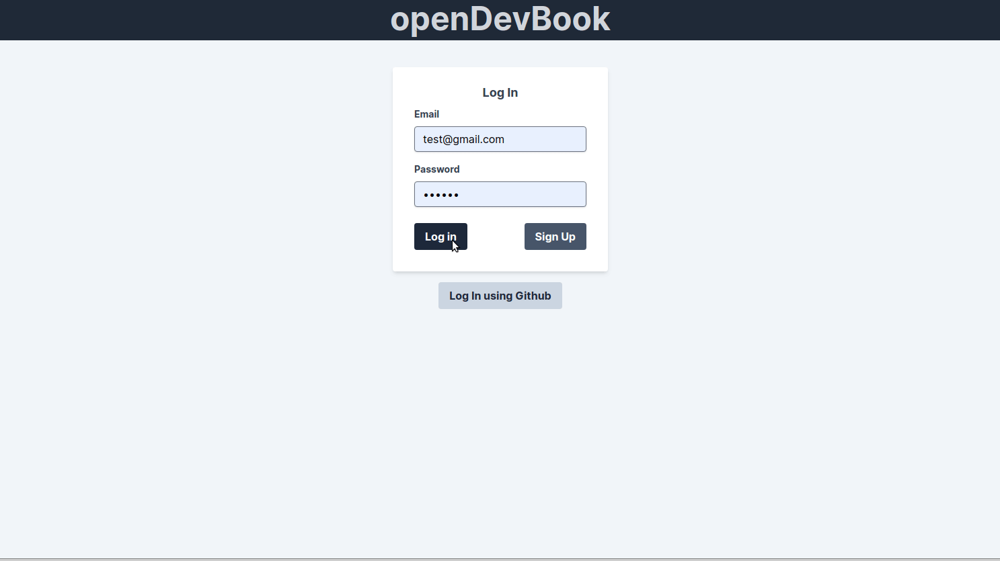

## openDevBook

## Table of Concepts

- [Overview](#overview)
- [My Process](#my-process)
    - [Development Features](#development-features)
    - [What I learned](#what-i-learned)
    - [Continued Development](#continued-development)
- [Author](#author)
- [License](#license)

## Overview 

A Ruby on Rails social media app for open-source contributors, based off of Facebook. Features include friends, friendship requests, notifications, posts, comments, and likes. 

You can find a [live version of openDevBook here](www.opendevbook.com). 

The simplest way to test the features is to log in as:
email: **test@gmail.com**
password: **123456**

*or* 

To test the most this app has to offer, `Log in with GitHub`, authentication for which is implemented using [Omniauth](https://github.com/omniauth/omniauth). This will auto-fill an initial post for you using GitHub's API, typing out a description of the most recent GitHub public project you're working on!

You'll also receive an automatic friend request from the test user - Jebediah Johnson, which you can accept in the `Friend Requests` tab.

*or*

Create an account by clicking `Sign Up` and filling out the form, authentication for which is implemented using [Devise](https://github.com/heartcombo/devise/). Just the same as a GitHub account creation, this will generate an automatic friend request you can accept. 

## My Process

A large accomplishment for me through the course of this project was not needing any help outside of perusing documentation. I know the value of asking for help with a context-rich question when you've been stuck for a couple of hours, but in the course of this project things really came together and I didn't need to do that even once. Every issue was resolved in a matter of hours, and I think there's a couple of reasons for this:

- Thoroughly planned, but open to change. Before I wrote any code I took a full day to plan out the entire data architecture. The model, schemas, associations - for each one thinking about how an actual user interacts with a social media website such as Facebook. That said, once every new model and feature was implemented I also took a step back and re-assessed to see if any part of the architecture needed to be changed - for example realising the value in utilizing polymorphic associations and adjusting my plan accordingly.  

- System tested. I created my system tests prior to writing the code, and wrote features which would guarantee every part of the system worked seamlessly together. 

- Having familiarity with every tool at the disposal. When starting out with Rails and even after a couple of projects, the amount of tools and concepts can be intimidating. The messages your terminal is sending every time a page loads, how to use `rails console`, how when and where to `debug`, which gems to use, how to plan and implement a project. After half a dozen projects or so a lot of these concepts and their utility becomes second nature, and there's no way around becoming more independent of a developer than continuous practice and constant exposure to new concepts.  

### Development Features

- Automated integration tested using [RSPec](https://github.com/rspec/rspec-rails) and [Capybara](https://github.com/teamcapybara/capybara) to perform tests, alongside [Guard](https://github.com/guard/guard) to re-run tests with every code change, and [FactoryBot](https://github.com/thoughtbot/factory_bot)/[Faker](https://github.com/faker-ruby/faker) to generate test data. 
- GitHub API utilized with to request data regarding GitHub user's most recent repository, and the first sentence of that repository's readme. 
- Performance improved by resolving N+1 queries with eager loading. These were monitored through both the Linux terminal and with [Bullet](https://github.com/flyerhzm/bullet0)
- Behaviour driven development adhered to from beginning to end by planning data architecture (models, associations, schemas) around the user's actions and keeping user experience in mind with every added feature. 
- Styling performed with the [Tailwind CSS](https://tailwindcss.com/) framework to reduce cycle time. Tailwind was effortless to pick up and use having already acquired a solid understanding of the CSS concepts it utilizes. 
- PostgreSQL used exclusively from development to production over previously used SQLite to perform more complex queries
- DDOS protection 

### What I learned
This project solidified my comfort planning, testing, and debugging larger scale Rails applications. I didn't run into any issues which I couldn't resolve by perusing documentation, conducting research, or `debug`ging my way through the MVC structure or interacting with the `rails console`. I believe part of this is also due to the planning I did prior to beginning the project, and another part is due to the quality of the integration tests I wrote. 

All in all this project was a joy to work on, and I'm looking forward to continuing implementing features for it.

### Continued Development
- Utilize AWS3 to host user uploaded profile pictures, facilitated through Active Storage

## Author

- [Personal Portfolio: www.mgrigo.com](www.mgrigo.com)

## License

This project is licensed under the terms of the MIT license.